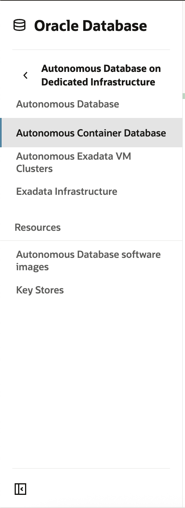
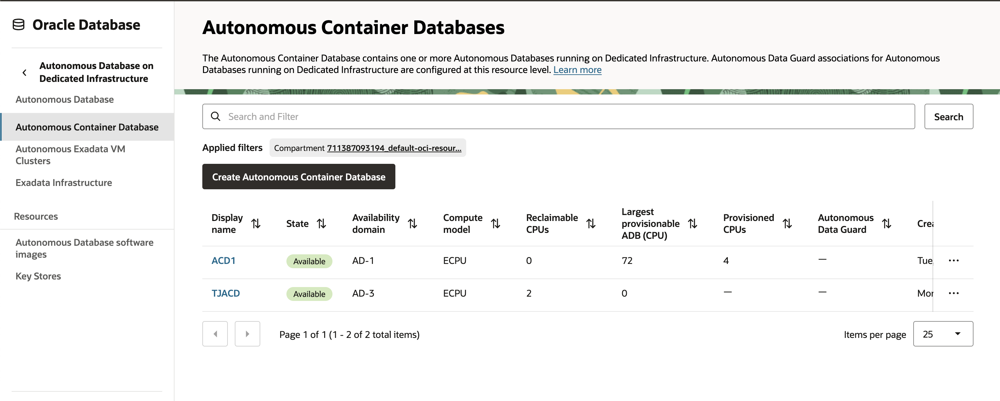
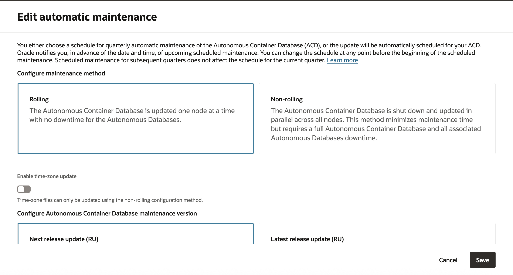
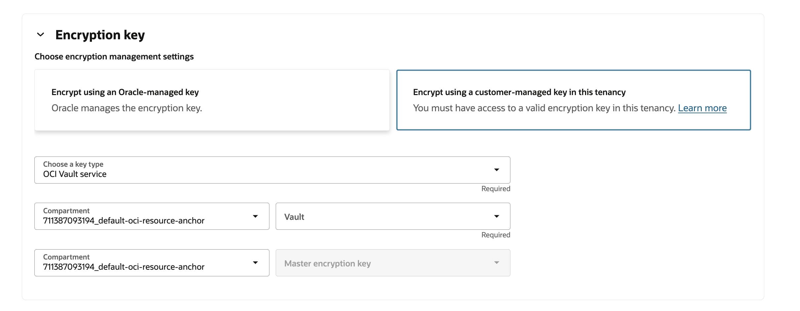

# Create and Manage Autonomous Container Database

## Introduction
Autonomous Container Database (ACD) is one of the four components of the four-level database architecture model, which is the foundation for an Autonomous Database on Dedicated Exadata Infrastructure. ACDs are provisioned inside an Autonomous Exadata VM Cluster (AVMC) and serve as containers for one or more Autonomous Databases.

You can create multiple ACD resources in a single AVMC resource, but you must create at least one before you can create any Autonomous Databases. Click [here](https://docs.oracle.com/en/cloud/paas/autonomous-database/dedicated/adbaa/index.html#GUID-268B36E1-87D8-4649-A370-226E2AE3FC5C) to gain a comprehensive understanding of the four-layer architecture used with the an Autonomous Database on Dedicated Exadata Infrastructure and to understand the positioning of ACD within this architecture.

In this lab, you will learn how to Create and Manage Autonomous VM Cluster.

Estimated Time: 30 minutes

### Objectives

1. Create Autonomous Container Databases
2. Manage Autonomous Container Databases

### Prerequisites
- A pre-provsioned ODB Network
 A pre-provsioned Oracle Exadata Infrastructure
- A pre-provsioned Autonomous VM Cluster

## Task 1: Create Autonomous Container Database

- Autonomous Container Database creation is managed from the OCI Console. From your AVMC details page in AWS, click “Manage in OCI” and log in to your OCI tenancy.

  

- Click on Oracle Database from the OCI Menu, and select Autonomous Database on Dedicated infrastructure.

  

  - Expand the Menu and select Autonomous Contanier Database.

  

  - ACD Details page lists all the avialable Autonomous Container Databases in the selected Compartment.

  

  - To Create an ACD, Click on Create Autonomous Container Database. Enter a Display Name, Select a Compartment, enter ACD name, and choose the Exadata infrastructure and AVMC you want the ACD to be in. 

  

- In the Basic Information, select the Oracle Database version from a Base image or Custom image you have created. Learn more about Base images and Customer image [here](https://docs.oracle.com/en/cloud/paas/autonomous-database/dedicated/adbaz/).

  

- Automatic maintenance configuration allows you to configure Maintenance method, ACD maintenance version, and Maintenance schedule.

  

- Click on Modify maintenance schedule to Edit automatic maintenance. Click [here](https://docs.oracle.com/en/cloud/paas/autonomous-database/dedicated/uzzru/index.html) to learn more Maintenance Preferences and best practices.

  

- In the Configure database backups section, configure database backups by specifying the settings for backing up the database.

  Enable automatic backup: Select to enable automatic backups for this database.

  

- Enter Customer Contact to recieve notifications and announcements.

  

- Advanced options: Autonomous Database resource management 
  
    Resource management attributes affect how resources are managed to either consolidate more databases or have the highest database availability.
    
    Database split threshold (CPU): The CPU value beyond which an Autonomous Database will be opened across multiple nodes.
    
    Node failover reservation (%): Determines the percentage of CPUs reserved across nodes to support node failover.
    
    Distribution affinity: Determines whether an Autonomous Database must be opened across a minimum or maximum of nodes.

  

- Advanced options: Net services architecture

    Optionally, you can enable Shared Server architecture whch enables a database server to allow many client processes to share very few server processes. 

  

- Advanced options: Encryption key

    In the Encryption section, to manage your database keys select Encrypt using an Oracle-managed key or Encrypt using a customer-managed key in this tenancy.  For more information about the options to manage your database keys, see [Master Encryption Keys in Autonomous Database](https://docs.oracle.com/en/cloud/paas/autonomous-database/dedicated/adbcz/index.html#articletitle)

  

- Optionally, you can add Tags to the ACD. 

  

## Task 2: Manage Autonomous Container Database

You may now **proceed to the next lab** to provision Autonomous Container Database.

## Acknowledgements

*All Done! You have successfully created ODB network and ODB peering connection.*

- **Author** - Tejus Subrahmanya, Principal Product Manager, Autonomous Database 

- **Last Updated By/Date** - Tejus Subrahmanya, June 2025