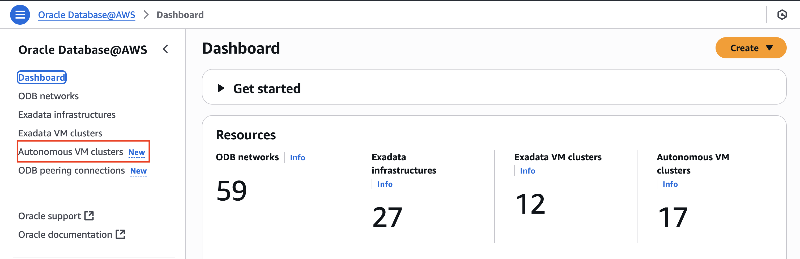
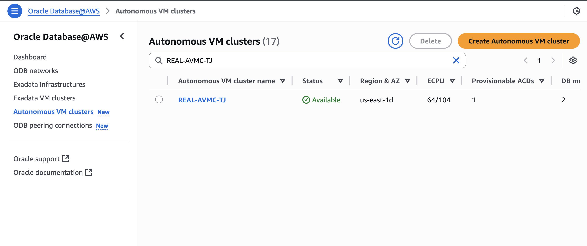
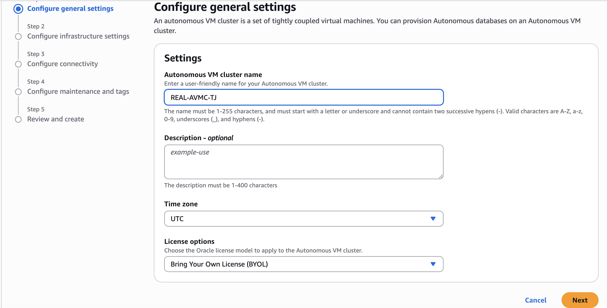
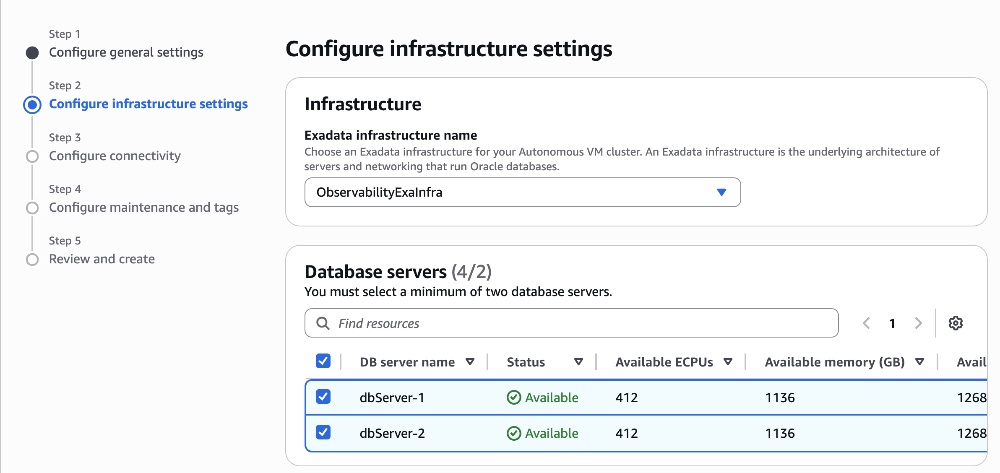
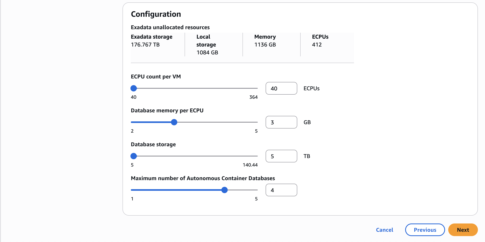
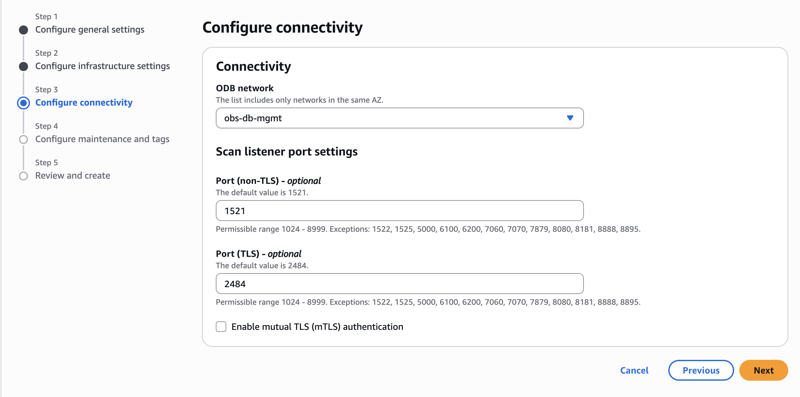
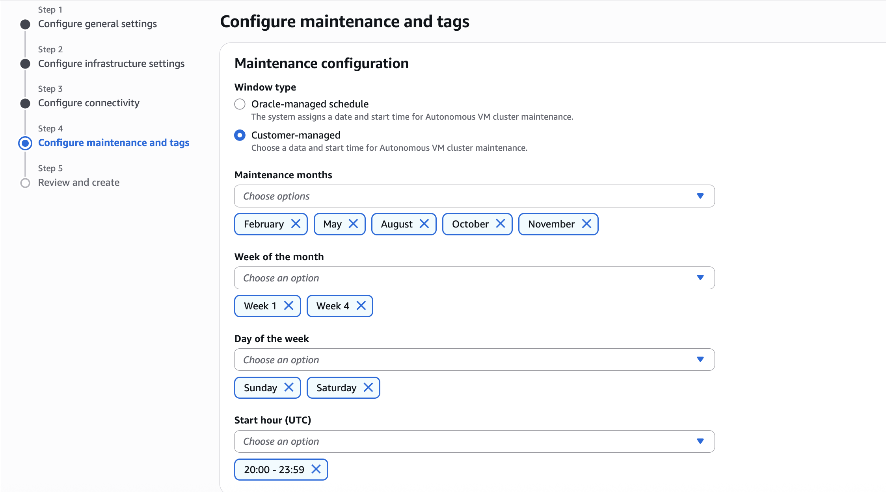
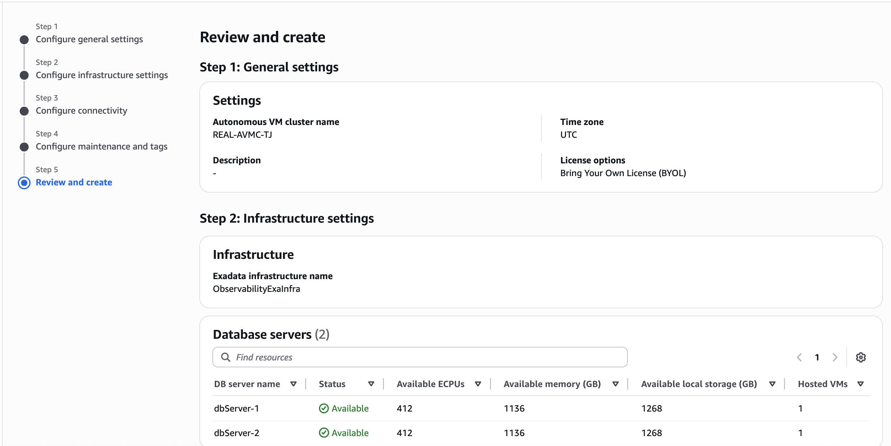
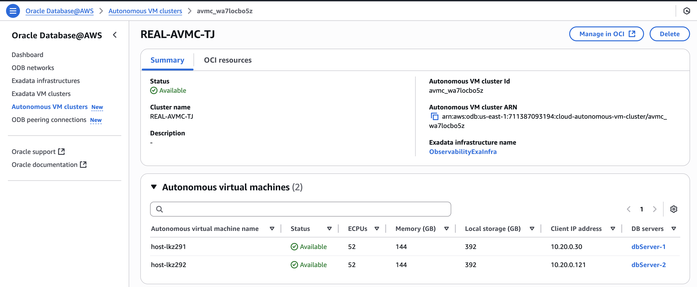
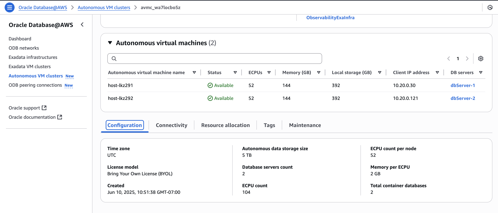

# Create Autonomous VM Cluster

## Introduction

Autonomous VM Clusters (AVMCs) allow a physical Exadata Cluster (Machine) to be partitioned into multiple virtual clusters. They can be used to isolate environments for different database workloads through separate access rules, network configurations, as well as customizable compute memory, and storage resources.

The AVMC is one of the infrastructure components of the four-level database architecture model on which an Autonomous Container Database is built. One or more AVMCs are provisioned inside an Exadata Infrastructure resource (EI), providing the link between the EI and the Autonomous Container Database resources in your deployment.

AVMCs provide isolated environments for different database workloads through separate access rules, network configurations, as well as customizable compute memory, and storage resources.

In this lab, you will learn how to Create Autonomous VM Cluster.

Estimated Time: 30 minutes

### Objectives

1. Create Autonomous VM Cluster in AWS

### Required Artifacts

- Existence of an Oracle Exadata Infrastructure
- ODB Network

## Task 1: Create Autonomous VM Cluster

1.	From the Oracle Database@AWS dashboard, select the Autonomous VM Clusters link.

    

-  Autonomous VM clusters details page lists all provisioned AVMCs in your Tenancy.

    

- Click on Create Autonomous VM cluster to configure general settings which allows you to enter a 'VM cluster name', select the 'Time Zone' for your Autonomous VM Cluster, and 'License options' to Bring Your Own License (BYOL) or License included.
    
    

- Configure infrastructure settings allows you to allows you to select an existing 'Exadata Infrastructure' for your Autonomous VM Cluster, select 'Database servers' (at a minimum, you must select 2). 

    

- Enter the details for ECPU core count per VM, Database memory per ECPU, Database storage, Maximum number of Autonomous Container Databases (The minimum and maximum values depend upon resources available in your Exadata Infrastructure).
    
    

- Configure connectivity allows you to select the ODB network, and modify the Scan listener port settings. The default for Port (non-TLS) is set to 1521 and he default for Port (TLS) is set to 2484. Optionally, you can Enable mutual TLS (mTLS) authentication.

    

- Under the Maintenance configuration section, you can select the Oracle-managed schedule option, the system automatically assigns a date and start time for AVMC maintenance or Customer-managed to pick a specific date and start time.

    

- Review and Create your Autonomous VM Cluster.

    

- Once the AVMC is provisioned you can click on your AVMC to view the details.

    

    

You may now **proceed to the next lab** to provision Autonomous Container Database.

## Acknowledgements

*All Done! You have successfully created ODB network and ODB peering connection.*

- **Author** - Tejus Subrahmanya, Principal Product Manager, Autonomous Database 

- **Last Updated By/Date** - Tejus Subrahmanya, June 2025